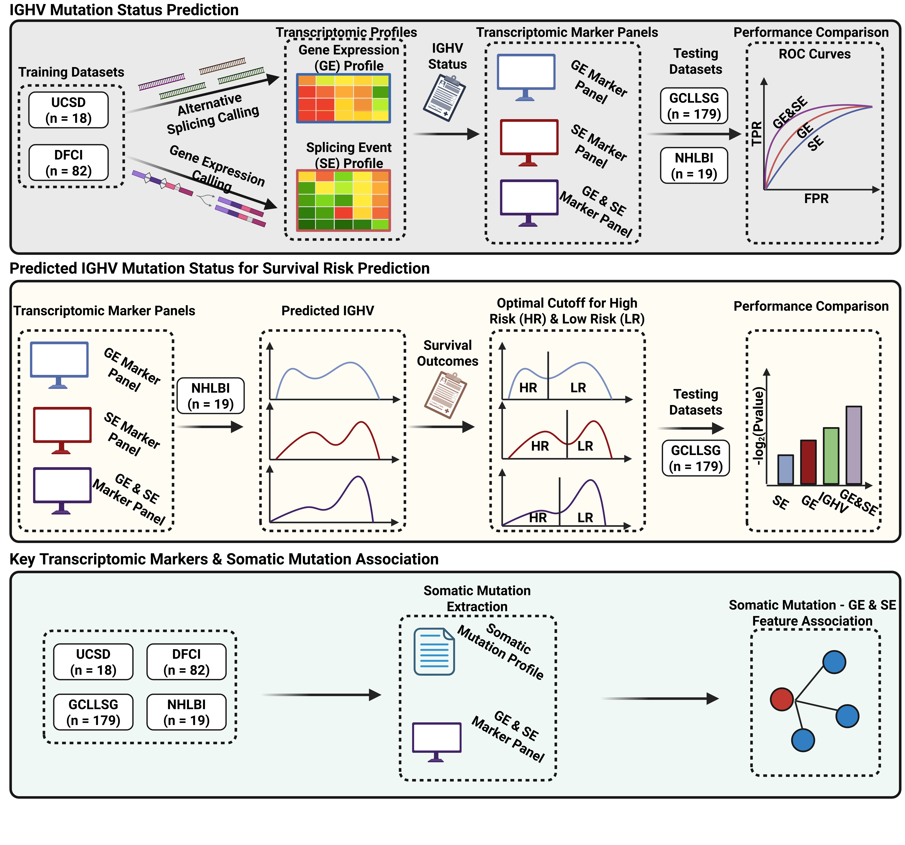

# Integration of Gene Expression and Alternative Splicing Enhances IGHV Mutation Status and Survival Risk Prediction in Chronic Lymphocytic Leukemia

[](https://www.r-project.org/)
[](https://opensource.org/licenses/MIT)

## Overview

This repository contains R scripts for predicting IGHV mutation status in chronic lymphocytic leukemia (CLL) patients using machine learning approaches and evaluating the clinical utility of these predictions for survival risk stratification. Code part for manuscript: **Integration of Gene Expression and Alternative Splicing Enhances IGHV Mutation Status and Survival Risk Prediction in Chronic Lymphocytic Leukemia**

## Workflow



## Key Features

- **Multi-modal prediction models**: Gene expression (GE), splicing events (PSI), and combined feature approaches
- **LASSO regression**: Regularized linear models for feature selection and prediction
- **Risk stratification**: Optimal cutoff determination for survival outcome prediction
- **Comprehensive validation**: Training, validation, and independent testing cohorts
- **Survival analysis**: Kaplan-Meier curves and log-rank tests for clinical outcomes

## Repository Structure

```
├── scripts/
│   ├── 01_train_ighv_prediction_models.R          # Model training and feature selection
│   └── 02_ighv_risk_stratification_survival.R     # Validation and survival analysis
├── data/                                          # Input data files (see Data Requirements)
├── results/                                       # Output files and model objects
│   ├── predictions/                               # Prediction tables for all cohorts
│   ├── cutoff_optimization/                       # Optimal cutoffs and performance metrics
│   └── selected_features.rds                      # Lists of selected features per model
├── figures/                                       # Generated plots and visualizations
│   └── survival_analysis/                         # Kaplan-Meier curves and cutoff plots
└── README.md                                
```

## Methodology

### Model Training (`01_train_ighv_prediction_models.R`)

1. **Feature preprocessing**: Load and align gene expression and splicing event matrices
2. **Model training**: Train three LASSO regression models:
   - Gene expression only (GE model)
   - Splicing events only (PSI model) 
   - Combined features (Combined model)
3. **Feature selection**: Extract selected features using cross-validated optimal λ
4. **Visualization**: Generate Venn diagram of overlapping selected features

### Risk Stratification (`02_ighv_risk_stratification_survival.R`)

1. **Model application**: Apply trained models to validation and test cohorts
2. **Cutoff optimization**: Systematic evaluation of risk stratification thresholds (0.01-0.75)
3. **Validation**: Select optimal cutoffs using validation cohort survival outcomes
4. **Testing**: Evaluate final performance on independent test cohort
5. **Survival analysis**: Generate Kaplan-Meier curves for overall survival (OS) and failure-free survival (FFS)

## Data Requirements

The analysis requires the following input files in the `data/` directory:

### Feature Matrices
- `Training_PSI_Profile.rds`: Training splicing event profiles (samples × PSI features)
- `Training_Gene_Expression_Profile.rds`: Training gene expression profiles (samples × genes)
- `whole_validation_psi_table.rds`: Validation PSI profiles
- `validation_gene_count.rds`: Validation gene expression profiles
- `whole_testing_psi_table.rds`: Testing PSI profiles  
- `testing_gene_count.rds`: Testing gene expression profiles

### Clinical Data
- `Clinical_Outcome.rds`: Training clinical metadata
- `validation_cli.rds`: Validation clinical metadata
- `testing_cli.rds`: Testing clinical metadata

**Required clinical variables:**
- `IGHV_mut`: IGHV mutation status ("mutated"/"unmutated")
- `os_days`: Overall survival time (days)
- `os`: Overall survival event (0/1)
- `ffs_days`: Failure-free survival time (days)
- `ffs`: Failure-free survival event (0/1)

## Installation and Dependencies

### R Version
- R ≥ 4.0.0

### Required Packages
```r
# Core packages
install.packages(c("glmnet", "caret", "dplyr", "survival", "survminer"))

# Visualization and data handling
install.packages(c("ggvenn", "data.table", "ggplot2", "tidyverse", "reshape2"))

# Additional survival analysis
install.packages(c("survcomp", "ggsurvfit", "plotROC"))
```

## Usage

### Quick Start

1. **Prepare your data**: Place all required data files in the `data/` directory
2. **Train models**: Run the first script to train IGHV prediction models
   ```r
   source("scripts/01_train_ighv_prediction_models.R")
   ```
3. **Evaluate models**: Run the second script for validation and survival analysis
   ```r
   source("scripts/02_ighv_risk_stratification_survival.R")
   ```

### Script Execution

The scripts should be run in order:

#### Script 1: Model Training
```r
# Train LASSO models and select features
source("scripts/01_train_ighv_prediction_models.R")
```

**Outputs:**
- `results/ighv_prediction_models.rds`: Trained model objects
- `results/selected_features.rds`: Selected features for each model
- `figures/IGHV_feature_selection_venn.pdf`: Feature overlap visualization

#### Script 2: Risk Stratification and Survival Analysis
```r
# Optimize cutoffs and perform survival analysis
source("scripts/02_ighv_risk_stratification_survival.R")
```

**Outputs:**
- `results/predictions/`: Prediction tables for all cohorts
- `results/cutoff_optimization/optimal_cutoffs.csv`: Optimal risk stratification thresholds
- `figures/survival_analysis/`: Kaplan-Meier survival curves
- `figures/survival_analysis/cutoff_optimization.pdf`: Cutoff optimization visualization

## Key Results

### Model Performance
- **Feature Selection**: Models select distinct but overlapping feature sets
- **Risk Stratification**: Optimal cutoffs determined via validation cohort
- **Survival Prediction**: Significant stratification of both OS and FFS outcomes
- **Clinical Utility**: Predicted risk groups show comparable discrimination to actual IGHV status

### Expected Outputs
1. **Training metrics**: Cross-validation performance and selected features
2. **Optimal cutoffs**: Risk stratification thresholds for OS and FFS
3. **Test performance**: Independent validation of survival prediction
4. **Visualization**: Publication-ready Kaplan-Meier curves and optimization plots

## Publication

When using this code, please cite:

```
**TBD**
```

### Getting Help

1. **Check the Issues tab** for common problems and solutions
2. **Review error messages** - the scripts include detailed error checking
3. **Verify data format** - ensure input files match the expected structure
4. **Contact**: Open an issue on GitHub for specific problems

## Contributing

We welcome contributions! Please:

1. Fork the repository
2. Create a feature branch (`git checkout -b feature/amazing-feature`)
3. Commit your changes (`git commit -m 'Add amazing feature'`)
4. Push to the branch (`git push origin feature/amazing-feature`)
5. Open a Pull Request

## License

This project is licensed under the MIT License - see the [LICENSE](LICENSE) file for details.

## Contact

- **Author**: Lei Yu
- **Email**: lei.yu@email.ucr.edu 
- **Institution**: 1. Genetics, Genomics and Bioinformatics Program, 2. Department of Botany & Plant Sciences, University of California, Riverside
- **Lab/Group**: [Dr. Zhenyu Jia Lab @ UC, Riverside](https://jialab.ucr.edu/people) & [Dr. Lili Wang Lab @ City of Hope](https://www.cityofhope.org/research/find-a-scientist/lili-wang)


---